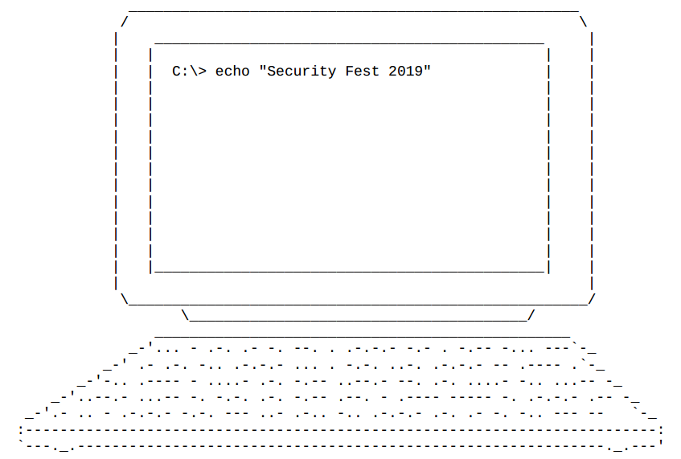

## Writeups for challenges `signal	` and `hydra`

### Challenge 1 - Signal
We're given a tar.gz file and a message along with it which reads `There is no signal, everything is silent.Nothing is impossible.`
```
$ tar -xzvf signal.tar.gz
signal.pdf
```
So we got a pdf. I ran `strings` command to see if I would find anything useful.
```
$ strings signal.pdf
# nothing useful found
```
So, I open the pdf and see if I can find anything inside. This is what's inside the pdf.



After gazing at it for a while, it somehow clicked to me that I've seen the pattern present in the keyboard. It represents morse code! So, I tried to decode it.
The morse code is
```
... - .-. .- -. --. . .-.-.- -.- . -.-- -... ---
 .- .-. -.. .-.-.- ... . -.-. ..-. .-.-.- -- .---- .
-.. .---- - ....- .-. -.-- ..--.- --. .-. ....- -.. ...-- 
..--.- ...-- -. -.-. .-. -.-- .--. - .---- ----- -. .-.-.- .-- 
.- .. - .-.-.- -.-. --- ..- .-.. -.. .-.-.- .-. .- -. -.. --- -- 
```
Decoding it [online](https://www.browserling.com/tools/morse-to-text) gave `strange.keyb?ard.secf.m1?1t4ry_gr4d3?3ncrypt10n.w?it.could.random `. Hmm, some letters seem missing. Wait, if this is a morse code, it should be a continuous signal. So, i removed the new line breaks and decoded again. This gave me `strange.keyboard.secf.m1l1t4ry_gr4d3_3ncrypt10n.wait.could.random `. Yay, we got our flag!

### Challenge 2 - Hydra
We're again provided with a tar.gz file and a message `The investigator found this image on one of the banks servers.`
```
$ tar -xzvf hydra.tar.gz
hydra.png
$ ls -l .
total 5028
-rw-rw-r-- 1 ghostman ghostman 5147109 May 18 04:45 hydra.png
```


```
$ strings hydra.png
# returned a lot of stuff, so I tried grepping plausible things
$ strings hydra.png | grep "flag"
flag.txt
Looking for flag....
```
Interesting. I opened up the image now in hex editor and started browsing through it. While browsing through it, I found more that one `IEND trailer`, suggesting image embedded inside. But wait, browsing further, I found that there was a pdf, a txt file and an iso file also embedded in the image.

It's time for binwalk!
```
$ binwalk -e hydra.png
DECIMAL       HEXADECIMAL     DESCRIPTION
--------------------------------------------------------------------------------
0             0x0             PNG image, 3200 x 2400, 8-bit/color RGBA, non-interlaced
62            0x3E            Zlib compressed data, best compression
4284376       0x415FD8        Zlib compressed data, default compression
4284810       0x41618A        Copyright string: "Copyright</rdf:li>"
4284979       0x416233        ELF, 64-bit LSB processor-specific, (GNU/Linux)
4285074       0x416292        Copyright string: "Copyright (C) 1993-2019 the SECF Team. All Rights Reserved. "
4285173       0x4162F5        SQLite 3.x database,
4285335       0x416397        JPEG image data, EXIF standard
4285379       0x4163C3        PNG image, 282 x 120, 8-bit colormap, non-interlaced
4285655       0x4164D7        Zlib compressed data, default compression
4287414       0x416BB6        Zlib compressed data, default compression
4287888       0x416D90        Copyright string: "Copyright</rdf:li>"
4288148       0x416E94        GIF image data, version "87a",
4288235       0x416EEB        gzip compressed data, from FAT filesystem (MS-DOS, OS/2, NT), last modified: 1970-01-01 00:00:00 (null date)
4288500       0x416FF4        ARJ archive data, header size: 45, version 11, minimum version to extract: 1, slash-switched, compression method: stored, file type: comment header, original file date: 2019-05-17 12:09:03, compressed file size: 1558094943, uncompressed file size: 0, os: Unix
4288555       0x41702B        ARJ archive data, header size: 57, version 11, minimum version to extract: 1, slash-switched, compression method: stored, file type: binary, original file date: 2019-05-17 12:09:03, compressed file size: 858112, uncompressed file size: 858112, os: Unix
4321390       0x41F06E        ISO 9660 Primary Volume, System Identifier: "LINUX  ", Volume Identifier: "CDROM  "
5081202       0x4D8872        LZMA compressed data, properties: 0x51, dictionary size: 16777216 bytes, uncompressed size: 6492909783 bytes
5099634       0x4DD072        LZMA compressed data, properties: 0x5A, dictionary size: 16777216 bytes, uncompressed size: 6643904727 bytes
5101682       0x4DD872        LZMA compressed data, properties: 0x5B, dictionary size: 16777216 bytes, uncompressed size: 6660681943 bytes
5103730       0x4DE072        LZMA compressed data, properties: 0x5C, dictionary size: 16777216 bytes, uncompressed size: 6677459159 bytes
5105778       0x4DE872        LZMA compressed data, properties: 0x5D, dictionary size: 16777216 bytes, uncompressed size: 6694236375 bytes
5107826       0x4DF072        LZMA compressed data, properties: 0x5E, dictionary size: 16777216 bytes, uncompressed size: 6711013591 bytes
5118066       0x4E1872        LZMA compressed data, properties: 0x63, dictionary size: 16777216 bytes, uncompressed size: 6794899671 bytes
5120114       0x4E2072        LZMA compressed data, properties: 0x64, dictionary size: 16777216 bytes, uncompressed size: 6811676887 bytes
5122162       0x4E2872        LZMA compressed data, properties: 0x65, dictionary size: 16777216 bytes, uncompressed size: 6828454103 bytes
5124210       0x4E3072        LZMA compressed data, properties: 0x66, dictionary size: 16777216 bytes, uncompressed size: 6845231319 bytes
5136498       0x4E6072        LZMA compressed data, properties: 0x6C, dictionary size: 16777216 bytes, uncompressed size: 6945894615 bytes
5138546       0x4E6872        LZMA compressed data, properties: 0x6D, dictionary size: 16777216 bytes, uncompressed size: 6962671831 bytes
5140594       0x4E7072        LZMA compressed data, properties: 0x6E, dictionary size: 16777216 bytes, uncompressed size: 6979449047 bytes
5146874       0x4E88FA        JPEG image data, EXIF standard
5146944       0x4E8940        gzip compressed data, from Unix, last modified: 2019-05-17 17:35:09
```
Lots of files extracted here! Argh!!!!!!!!!
```
$ file _hydra.png.extracted/*
_hydra.png.extracted/3E:          empty
_hydra.png.extracted/3E.zlib:     zlib compressed data
_hydra.png.extracted/415FD8:      ASCII text
_hydra.png.extracted/415FD8.zlib: zlib compressed data
_hydra.png.extracted/4164D7:      data
_hydra.png.extracted/4164D7.zlib: zlib compressed data
_hydra.png.extracted/416BB6:      ASCII text
_hydra.png.extracted/416BB6.zlib: zlib compressed data
_hydra.png.extracted/416EEB.gz:   gzip compressed data, from FAT filesystem (MS-DOS, OS/2, NT)
_hydra.png.extracted/416FF4.arj:  ARJ archive data, v11, slash-switched, original name: , os: Unix
_hydra.png.extracted/41F06E.iso:  data
_hydra.png.extracted/4D8872.7z:   data
_hydra.png.extracted/4DD072.7z:   data
_hydra.png.extracted/4DD872.7z:   data
_hydra.png.extracted/4DE072.7z:   data
_hydra.png.extracted/4DE872.7z:   data
_hydra.png.extracted/4DF072.7z:   data
_hydra.png.extracted/4E1872.7z:   data
_hydra.png.extracted/4E2072.7z:   data
_hydra.png.extracted/4E2872.7z:   data
_hydra.png.extracted/4E3072.7z:   data
_hydra.png.extracted/4E6072.7z:   data
_hydra.png.extracted/4E6872.7z:   data
_hydra.png.extracted/4E7072.7z:   data
_hydra.png.extracted/4E8940:      POSIX tar archive (GNU)
_hydra.png.extracted/hydra.iso:   UDF filesystem data (version 1.5) 'CDROM'
```
The first thing I did was mount the `hydra.iso` file. All it had was a file named `flag.txt` which contained nothing but `Looking for flag....`. So that was a dead end for me for now. I started exploring other files. Let's have a look at text files.
```
$ cat 415FD8 416BB6 
IPTC profile
      32
3842494d04040000000000131c02740007506978616261791c02000002000400

IPTC profile
      60
3842494d040400000000002f1c02740023667270737b466a306571733135755f73793474
5f7531717133615f31615f7a3367347d1c02000002000400
```
IPTC profile suggests about photo metadata. Maybe something hidden in metadata.
```
$ exiftool ./*
# gave me nothing useful
```
I was stuck here for hours. Then I remembered that in the original image, there was an image embedded as well, and binwalk didn't give that to me. It struck me that I should've run binwalk to extract all type signatures as well to see if I can get something.
```
$ binwalk -D=".*" hydra.png
DECIMAL       HEXADECIMAL     DESCRIPTION
--------------------------------------------------------------------------------
0             0x0             PNG image, 3200 x 2400, 8-bit/color RGBA, non-interlaced
62            0x3E            Zlib compressed data, best compression
4284376       0x415FD8        Zlib compressed data, default compression
4284810       0x41618A        Copyright string: "Copyright</rdf:li>"
4284979       0x416233        ELF, 64-bit LSB processor-specific, (GNU/Linux)
4285074       0x416292        Copyright string: "Copyright (C) 1993-2019 the SECF Team. All Rights Reserved. "
4285173       0x4162F5        SQLite 3.x database,
4285335       0x416397        JPEG image data, EXIF standard
4285379       0x4163C3        PNG image, 282 x 120, 8-bit colormap, non-interlaced
4285655       0x4164D7        Zlib compressed data, default compression
4287414       0x416BB6        Zlib compressed data, default compression
4287888       0x416D90        Copyright string: "Copyright</rdf:li>"
4288148       0x416E94        GIF image data, version "87a",
4288235       0x416EEB        gzip compressed data, from FAT filesystem (MS-DOS, OS/2, NT), last modified: 1970-01-01 00:00:00 (null date)
4288500       0x416FF4        ARJ archive data, header size: 45, version 11, minimum version to extract: 1, slash-switched, compression method: stored, file type: comment header, original file date: 2019-05-17 12:09:03, compressed file size: 1558094943, uncompressed file size: 0, os: Unix
4288555       0x41702B        ARJ archive data, header size: 57, version 11, minimum version to extract: 1, slash-switched, compression method: stored, file type: binary, original file date: 2019-05-17 12:09:03, compressed file size: 858112, uncompressed file size: 858112, os: Unix
4321390       0x41F06E        ISO 9660 Primary Volume, System Identifier: "LINUX  ", Volume Identifier: "CDROM  "
5081202       0x4D8872        LZMA compressed data, properties: 0x51, dictionary size: 16777216 bytes, uncompressed size: 6492909783 bytes
5099634       0x4DD072        LZMA compressed data, properties: 0x5A, dictionary size: 16777216 bytes, uncompressed size: 6643904727 bytes
5101682       0x4DD872        LZMA compressed data, properties: 0x5B, dictionary size: 16777216 bytes, uncompressed size: 6660681943 bytes
5103730       0x4DE072        LZMA compressed data, properties: 0x5C, dictionary size: 16777216 bytes, uncompressed size: 6677459159 bytes
5105778       0x4DE872        LZMA compressed data, properties: 0x5D, dictionary size: 16777216 bytes, uncompressed size: 6694236375 bytes
5107826       0x4DF072        LZMA compressed data, properties: 0x5E, dictionary size: 16777216 bytes, uncompressed size: 6711013591 bytes
5118066       0x4E1872        LZMA compressed data, properties: 0x63, dictionary size: 16777216 bytes, uncompressed size: 6794899671 bytes
5120114       0x4E2072        LZMA compressed data, properties: 0x64, dictionary size: 16777216 bytes, uncompressed size: 6811676887 bytes
5122162       0x4E2872        LZMA compressed data, properties: 0x65, dictionary size: 16777216 bytes, uncompressed size: 6828454103 bytes
5124210       0x4E3072        LZMA compressed data, properties: 0x66, dictionary size: 16777216 bytes, uncompressed size: 6845231319 bytes
5136498       0x4E6072        LZMA compressed data, properties: 0x6C, dictionary size: 16777216 bytes, uncompressed size: 6945894615 bytes
5138546       0x4E6872        LZMA compressed data, properties: 0x6D, dictionary size: 16777216 bytes, uncompressed size: 6962671831 bytes
5140594       0x4E7072        LZMA compressed data, properties: 0x6E, dictionary size: 16777216 bytes, uncompressed size: 6979449047 bytes
5146874       0x4E88FA        JPEG image data, EXIF standard
5146944       0x4E8940        gzip compressed data, from Unix, last modified: 2019-05-17 17:35:09

$ file _hydra.png.extracted/*
_hydra.png.extracted/0:           PNG image data, 3200 x 2400, 8-bit/color RGBA, non-interlaced
_hydra.png.extracted/3E:          empty
_hydra.png.extracted/3E-0:        zlib compressed data
_hydra.png.extracted/415FD8:      ASCII text
_hydra.png.extracted/415FD8.zlib: zlib compressed data
_hydra.png.extracted/41618A:      data
_hydra.png.extracted/416233:      ELF 64-bit LSB *unknown arch 0x666e* (GNU/Linux)
_hydra.png.extracted/416292:      data
_hydra.png.extracted/4162F5:      SQLite 3.x database
_hydra.png.extracted/416397:      JPEG image data, Exif standard: []
_hydra.png.extracted/4163C3:      PNG image data, 282 x 120, 8-bit colormap, non-interlaced
_hydra.png.extracted/4164D7:      data
_hydra.png.extracted/4164D7.zlib: zlib compressed data
_hydra.png.extracted/416BB6:      ASCII text
_hydra.png.extracted/416BB6.zlib: zlib compressed data
_hydra.png.extracted/416D90:      data
_hydra.png.extracted/416E94:      GIF image data, version 87a,
_hydra.png.extracted/416EEB:      empty
_hydra.png.extracted/416EEB-0:    gzip compressed data, from FAT filesystem (MS-DOS, OS/2, NT)
_hydra.png.extracted/416FF4:      ARJ archive data, v11, slash-switched, original name: , os: Unix
_hydra.png.extracted/41702B:      ARJ archive data, v11, slash-switched, original name: , os: Unix
_hydra.png.extracted/41F06E:      data
_hydra.png.extracted/4D8872.7z:   data
_hydra.png.extracted/4DD072.7z:   data
_hydra.png.extracted/4DD872.7z:   data
_hydra.png.extracted/4DE072.7z:   data
_hydra.png.extracted/4DE872.7z:   data
_hydra.png.extracted/4DF072.7z:   data
_hydra.png.extracted/4E1872.7z:   data
_hydra.png.extracted/4E2072.7z:   data
_hydra.png.extracted/4E2872.7z:   data
_hydra.png.extracted/4E3072.7z:   data
_hydra.png.extracted/4E6072.7z:   data
_hydra.png.extracted/4E6872.7z:   data
_hydra.png.extracted/4E7072.7z:   data
_hydra.png.extracted/4E88FA:      JPEG image data, Exif standard: []
_hydra.png.extracted/4E8940:      POSIX tar archive (GNU)
_hydra.png.extracted/4E8940-0:    gzip compressed data, last modified: Fri May 17 17:35:09 2019, from Unix
```
Ok, so we got that missing png file `4163C3` embedded inside the original picture. Let's have a look at it


It's text is a lot similar to the txt file data. Let's have a look at the metadata of this image.
```
$ exiftool 4163C3
ExifTool Version Number         : 10.10
File Name                       : 4163C3
Directory                       : .
File Size                       : 842 kB
File Modification Date/Time     : 2019:05:24 04:26:09+05:30
File Access Date/Time           : 2019:05:24 04:26:15+05:30
File Inode Change Date/Time     : 2019:05:24 04:26:09+05:30
File Permissions                : rw-rw-r--
File Type                       : PNG
File Type Extension             : png
MIME Type                       : image/png
Image Width                     : 282
Image Height                    : 120
Bit Depth                       : 8
Color Type                      : Palette
Compression                     : Deflate/Inflate
Filter                          : Adaptive
Interlace                       : Noninterlaced
Palette                         : (Binary data 210 bytes, use -b option to extract)
Transparency                    : 0
Copyright Notice                : frps{Fj0eqs15u_sy4t_u1qq3a_1a_z3g4}
Application Record Version      : 4
XMP Toolkit                     : Image::ExifTool 10.80
Rights                          : Copyright
Warning                         : [minor] Trailer data after PNG IEND chunk
Image Size                      : 282x120
Megapixels                      : 0.034
```
Look at the `Copyright Notice` metadata tag value - `frps{Fj0eqs15u_sy4t_u1qq3a_1a_z3g4}`.
This is classic caesar cipher, which with a shift of +13, translates to give us our flag - `secf{Sw0rdf15h_fl4g_h1dd3n_1n_m3t4}`.
